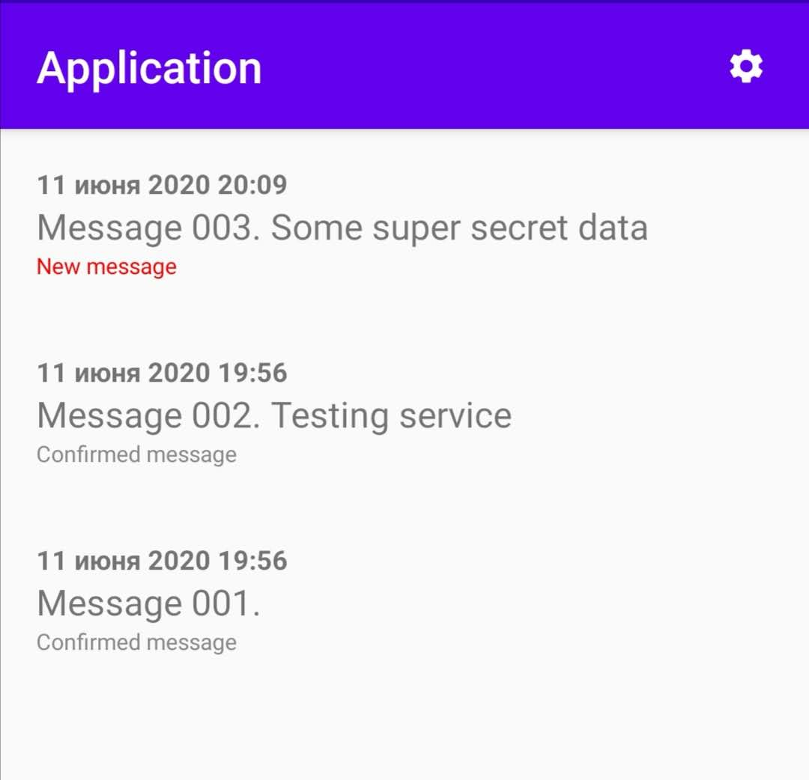
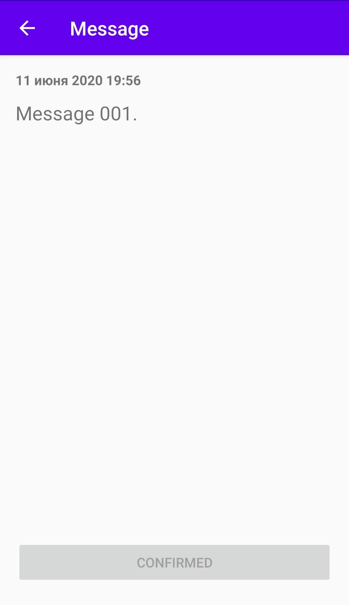
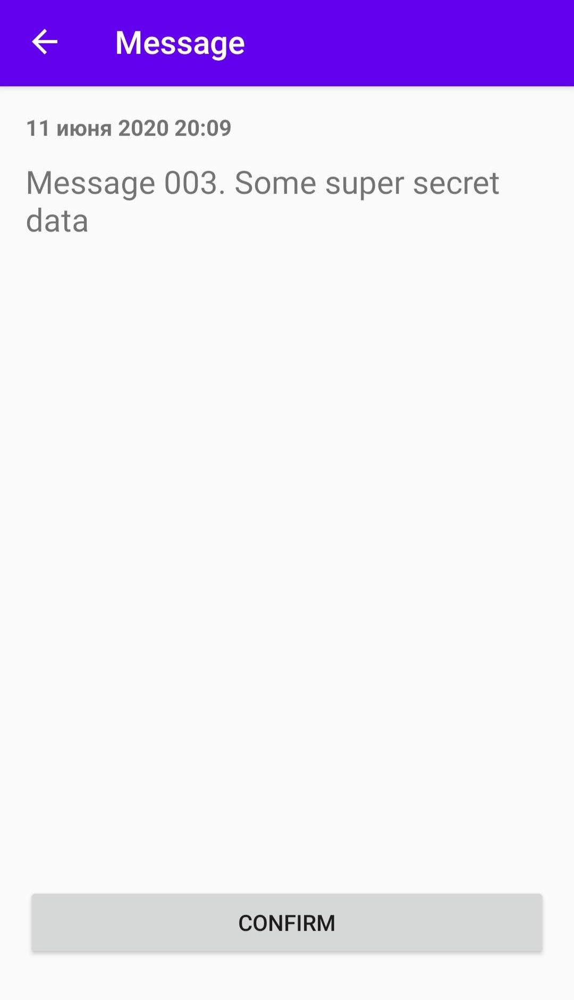

# Android app

Android application that recieves messages from server and send confirm to server that message was recieved

## Installation

1. [Add Firebase to your Android project](https://firebase.google.com/docs/android/setup)

    - Download google-services.json to obtain your Firebase Android config file (google-services.json).
    - Move your config file into the module (app-level) directory of your app.

2. Update server IP in [MyFirebaseMessagingService.kt](app/src/main/java/com/example/myapplication/MyFirebaseMessagingService.kt#L34) file in line 34 if you are not using 'localhost' to connect to web-app

```kotlin
private fun sendRegistrationToServer(token: String?) {
        val serverIp = "localhost"
        val serverPort = "8000"

        ...
```

3. Build and install app

## Screenshots





