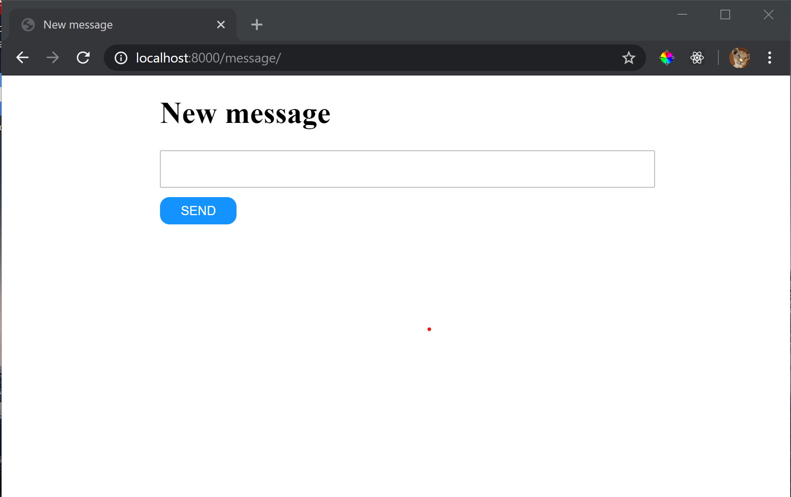

# Web application

Send messages to Android application

## Installation

### 1. Firebase Cloud Messaging server key

Update FCM Server key in [webapp/settings.py](webapp/settings.py#L136) file line 136

```python
FCM_DJANGO_SETTINGS = {
    "FCM_SERVER_KEY": "ENTER_FCM_SERVER_KEY"
}
```

### 2. Install app
    
1. If you have docker-compose installed run 

    ```sh
    docker-compose build
    docker-compose up -d
    ```

    When database is up and working run 

    ```sh
    docker-compose run web python manage.py makemigrations text_msg
    docker-compose run web python manage.py migrate
    ```

    If not working, try to restart containers
    ```sh
    docker-compose up -d
    ```
    
2. No docker and MySQL, well, you can use sqlite3 as database. Just fix database settings in [webapp/settings.py](webapp/settings.py#L78-L89) file lines 78-89

    ```python
    DATABASES = {
        'default': {
            'ENGINE': 'django.db.backends.sqlite3',
            'NAME': os.path.join(BASE_DIR, 'db.sqlite3'),
            # 'ENGINE': 'django.db.backends.mysql',
            # 'NAME': 'web-app-db',
            # 'USER': 'root',
            # 'PASSWORD': 'password',
            # 'HOST': 'db',
            # 'PORT': 3306,
        }
    }
    ```

    Run commands 
    
    ```sh
    python manage.py migrate
    python manage.py runserver 0.0.0.0:8000
    ```

### 3. Check app

Open in browser [localhost:8000](http://localhost:8000/)

Click button send message to send new message :)

## Screenshot


